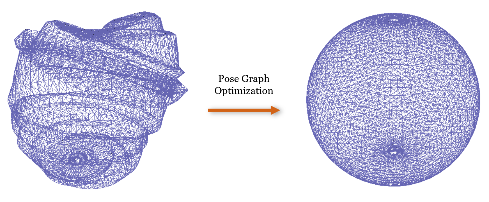

# This repository contains codes for a simple pose graph problem.

----------------------------

### SE3:
* Implementation based on Prof. Tim Barfoot's book (Section 8.3 in Ed.1; or, Section 9.3 in Ed.2)

### g2o:
* Implementation reference: [VSLAM book](https://github.com/gaoxiang12/slambook-en)

### ceres:
* Implementation using Ceres' Autodiff with unit quaternion representation for rotation.

----------------------------

Previous edit of readme: 2022-Oct-02